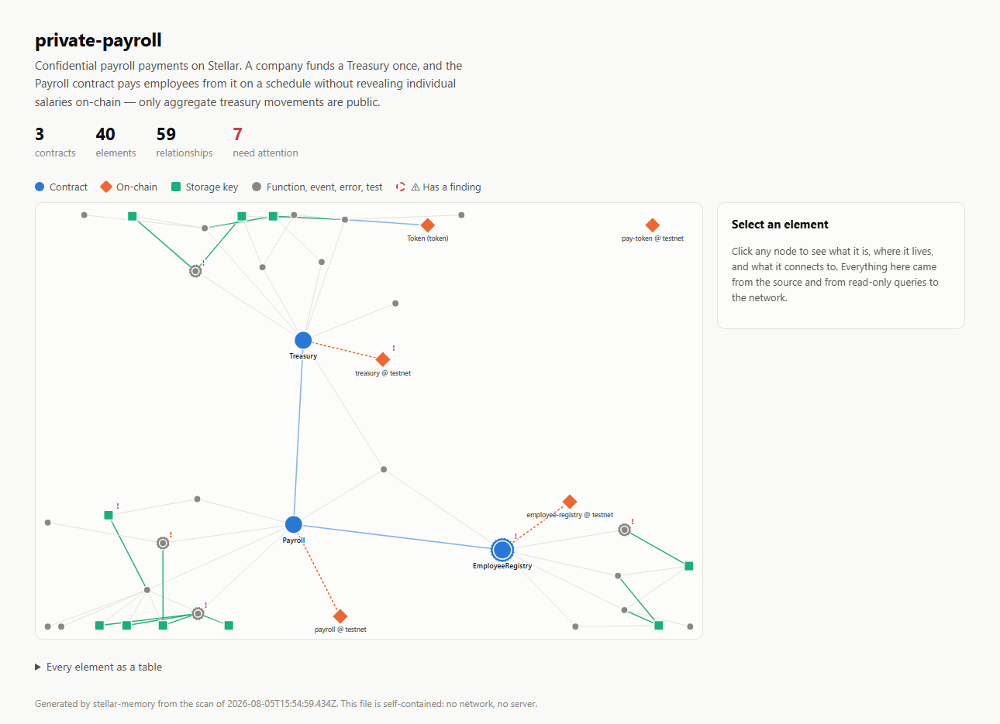

# stellar-memory

[](https://github.com/duraznito16/stellar-memory/actions/workflows/ci.yml)
[](https://www.npmjs.com/package/soroban-memory)

**A persistent memory layer for Stellar and Soroban projects.**

Current AI assistants help you *write* code. The harder problem is *keeping* the
context — what this project does, how its contracts fit together, why a decision
was made, and whether what is deployed still matches what is in your tree.

`stellar-memory` scans a Soroban repository, links its source to what is
actually live on the network, and stores the result as a knowledge graph that
both you and your AI agents can query.

```
$ stellar memory resume

private-payroll
Confidential payroll payments on Stellar. A company funds a Treasury once, and the
Payroll contract pays employees from it without revealing individual salaries.

Last commit  14 days ago on main

Contracts
  EmployeeRegistry       4 fn  deployed: testnet
  Payroll                4 fn  deployed: testnet
  Treasury               4 fn  deployed: testnet

  Entry points: Payroll

On-chain
  payroll                testnet   out of sync with local source
  pay-token              testnet   external dependency

Worth knowing
  ! Persistent key DataKey::LastPaid(employee) is never given an extend_ttl;
    it can expire and become unreachable.
  ! Payroll.set_pay_token changes state but never calls require_auth.

Open tasks
  □ Complete withdrawal tests for Payroll                README.md:24
  □ pay() needs an end-to-end test with a real Treasury  payroll/src/test.rs:23
```

---

## Why this is Stellar-specific

A generic "summarise my repo" tool cannot tell you any of this. `stellar-memory`
reads the things only a Soroban project has:

- **The real contract interface**, from the compiled Wasm or from the network —
  not from parsing `.rs` text. Functions, types, errors, and event definitions as
  the contract actually exposes them.
- **Code ↔ on-chain drift.** It compares the SHA-256 of your local build against
  the Wasm installed at your contract's address and tells you when what is
  running on testnet is older than what you have.
- **Real cross-contract edges**, resolved through `contractimport!` and the Wasm
  artifact each module imports — so `Payroll → Treasury` is evidence, not a guess.
- **Storage durability and TTL.** Every `instance` / `persistent` / `temporary`
  key, and whether it is ever given an `extend_ttl`. A persistent entry with no
  TTL extension can expire and become unreachable — a Soroban-only footgun that
  is easy to forget between sessions.
- **Whose authority, not whether there is any.** `require_auth` on an address
  loaded from storage is a real access-control gate. `require_auth` on a
  caller-supplied parameter restricts nobody — the caller just proves they
  control an address they chose. A boolean cannot tell those apart, so the
  memory records the subject and where it came from.
- **Upgradeability.** Whether a contract can replace its own code, and through
  which function. It is the fact that gates every other decision about it.
- **Error codes as published ABI.** Every `#[contracterror]` variant with its
  discriminant, and which functions can raise it. Clients match on the integer —
  a failed call reaches them as `Error(Contract, #2)` — so renumbering a variant
  breaks integrations without breaking the build. Scans compare the source
  discriminants against the deployed spec.
- **Where value moves.** Token and Stellar Asset Contract clients are not
  workspace crates, so nothing links them to a source file. The memory records
  each one, the methods called on it, and whether its address is configured in
  storage or supplied by the caller.

## Two front doors, one index

The same knowledge graph serves a human and an agent.

**You**, in the terminal:

```bash
stellar memory resume                       # get your context back
stellar memory explain "how does pay work?" # ask
stellar memory graph --format mermaid       # paste the map into a PR
```

**Your agent**, over MCP:

```jsonc
// .mcp.json / claude_desktop_config.json
{
  "mcpServers": {
    "stellar-memory": {
      "command": "stellar-memory",
      "args": ["--cwd", "/path/to/your/project", "mcp"]
    }
  }
}
```

The server exposes `project_overview`, `search_memory`, `describe_node`,
`list_contracts`, `storage_layout`, `value_surface`, `project_signals` and
`recent_changes` — so an agent can orient itself in a Soroban codebase before
touching it, instead of grepping blindly.

## It ships the agents, not just the data

```bash
stellar-memory init --with-agents
```

writes a team of Claude Code subagents into **your** project, already wired to
your memory:

| Agent | What makes it different |
|---|---|
| `stellar-resume` | Gets your context back after time away. Produces a briefing, not an analysis |
| `stellar-explorer` | Read-only, breadth-first. Answers with links into the vault so you can verify |
| `stellar-debugger` | Starts at a symptom and works *backward* through the graph. Will not propose a fix without a `file:line` |
| `stellar-builder` | The only one that edits contracts. Must read the project's auth and storage conventions first |
| `stellar-archivist` | Writes the *human* half of the notes — the reasoning a scan can never recover |

They differ in access pattern, tools and stopping rule, not in tone. The
archivist is the one that makes the vault compound: without someone recording
*why*, the human half of every note stays empty and the memory only ever
regenerates rather than accumulates.

## See it



```bash
stellar memory graph --format html
```

Writes one self-contained HTML file — no server, no build, no network — showing
the contracts, what they call, the storage they touch, and what is live on
chain. Click any node for its source location, its relationships, and any
findings against it. Nodes with something worth knowing carry a ring, and the
panel says what it is; colour never carries the meaning on its own.

It is deterministic: the same memory produces the same file, so it diffs in git
next to the vault it describes, and it can be committed or attached to a pull
request.

## The vault is a folder of Markdown

`scan` writes `.stellar-memory/`: an `index.json` for tooling, and one Markdown
note per contract, function, storage key, deployment and task, linked with
`[[wikilinks]]`.

That folder **is a valid Obsidian vault** — open it and the graph is there. It is
also diffable in git, so you can watch a team's understanding of a system evolve
alongside the code.

Each note has a machine-owned block:

```markdown
<!-- stellar-memory:auto -->
...regenerated on every scan...
<!-- /stellar-memory:auto -->

## Notes
Anything you write here is yours. It is never overwritten.
```

That split is the point. Structural facts stay current automatically; the
reasoning that source code cannot hold — why this design, what was tried and
rejected — is written once and kept forever. When a contract disappears, its
note is **marked stale, never deleted**.

## Install

```bash
npm install -g soroban-memory
```

The binary is named `stellar-memory`, so the Stellar CLI picks it up as a plugin
and `stellar memory <command>` works natively. `npx soroban-memory` works too.

Requires Node 20+. The Stellar CLI is optional — without it you still get the
full source-level memory, just not the on-chain half.

## Commands

| Command | What it does |
|---|---|
| `scan` | Analyse the repo and update the memory. Creates the vault if there isn't one. `--offline` skips all network and CLI calls |
| `resume` | Recover context: what this is, what moved, what is pending |
| `explain [question]` | Ask about the project. `--ai` for a written answer |
| `graph` | Show how it fits together — `tree`, `mermaid`, `dot`, `json`, or `html` |
| `check` | Exit non-zero when the project has blocking issues. For CI |
| `mcp` | Serve the memory to agents over MCP (stdio) |
| `init` | Create the vault explicitly. `--with-agents` also scaffolds the agent team |

## In CI

```bash
stellar-memory scan --offline
stellar-memory check --fail-on auth,ttl
```

`check` exits `1` when a checked category has findings, `0` when clean, and `2`
when it is misconfigured — a typo in `--fail-on` must not make a pipeline green
for the wrong reason. Categories: `drift`, `ttl`, `auth`, `abi`, `value`,
`tests`, or `all`.

The one worth wiring up first is **`drift`**. Testnet gets reset, people
redeploy by hand, and nobody knows whether what is running is what is on `main`.
That check answers it by comparing Wasm hashes, and there is nothing else that
will tell you.

A ready workflow — offline checks on every PR, drift checked separately so forks
without secrets skip rather than fail — is in
[`templates/workflows/stellar-memory.yml`](templates/workflows/stellar-memory.yml).

## The AI layer is optional

`scan`, `resume` and `graph` are fully deterministic — static analysis plus
read-only CLI calls. They work offline, with no API key, and their output is
reproducible.

Only `explain --ai` calls a model, and it is given the project digest and told to
answer strictly from it. Everything the AI produces is labelled as inferred; a
memory that confidently invents a contract is worse than no memory at all.

Set `ANTHROPIC_API_KEY` (or run `ant auth login`). Override the model with
`STELLAR_MEMORY_MODEL`.

## Safety

Every network call this tool makes is **read-only**: contract interfaces, Wasm
hashes, metadata, and alias lookups. It never signs, deploys, or spends. That
boundary is deliberate.

## Try it

The repo ships a demo Soroban workspace with real, deliberate defects:

```bash
git clone <this repo> && cd stellar-memory
npm install && npm run build
node dist/index.js --cwd demo/private-payroll init
node dist/index.js --cwd demo/private-payroll scan
node dist/index.js --cwd demo/private-payroll resume
```

## What CI proves

The badge above is not just "the tests pass". Every push runs the tool against
the demo Soroban workspace and asserts what it claims:

- **The parser agrees with the compiler.** The demo is built to Wasm, and the
  public functions the analyser reports are compared against the spec embedded
  in the compiled binary. Static analysis validated against `rustc`, not against
  opinion.
- **The gate works in all three states.** It fires on a category the demo
  genuinely fails, stays quiet on one it is clean on, and exits `2` — not `0` —
  on an unknown category, so a typo cannot turn a pipeline green.
- **The published artifact runs on the minimum supported Node.** The test suite
  runs on Node 24; the built CLI is exercised end to end on Node 20.
- **On-chain drift is checked against real testnet deployments.** Contract
  aliases are committed, so this needs no credentials — and every call is
  read-only.

That last job is `continue-on-error`. Testnet is reset periodically and these
contracts will vanish with it; that is a fact about the network, not a defect
here, and blocking merges on it would only train people to ignore the badge.

## Development

```bash
npm run build       # compile
npm test            # parser, MCP handshake, and CI-gate tests
npm run typecheck
```

Running the package needs **Node 20+**. Running the *tests* needs **Node 22.6+**,
because they are TypeScript executed through Node's native type stripping. CI
runs the suite on Node 24 and exercises the built CLI on Node 20, so the minimum
supported version is proven rather than asserted.

## License

Apache-2.0
