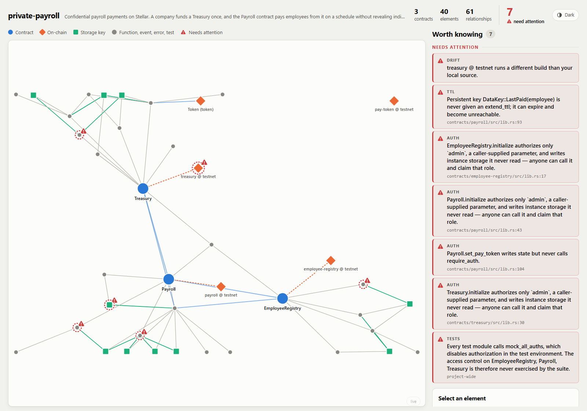
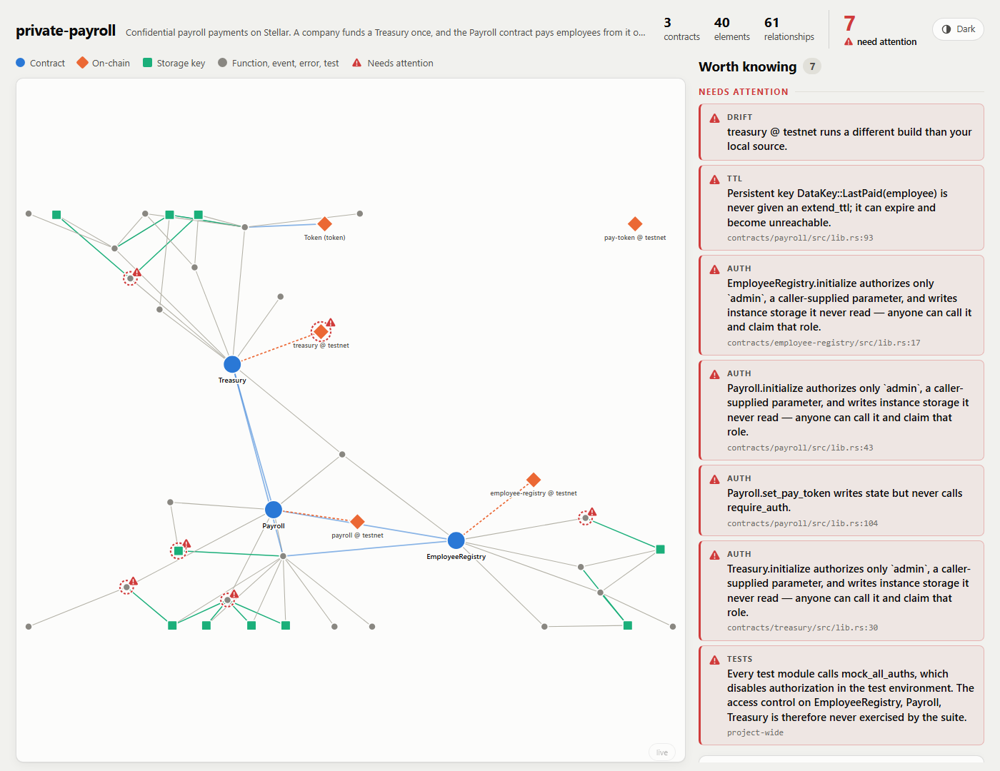
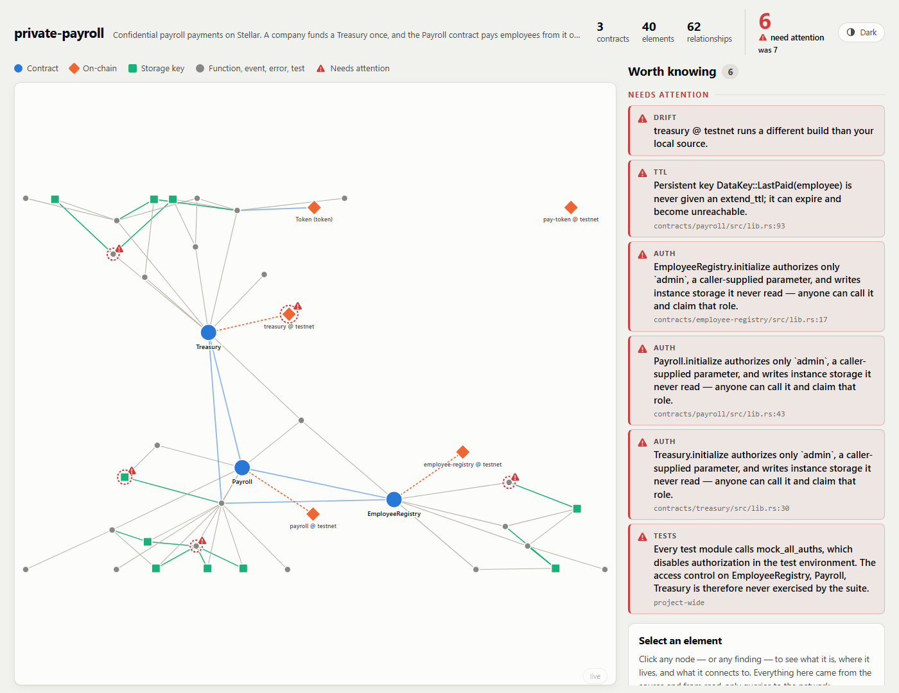
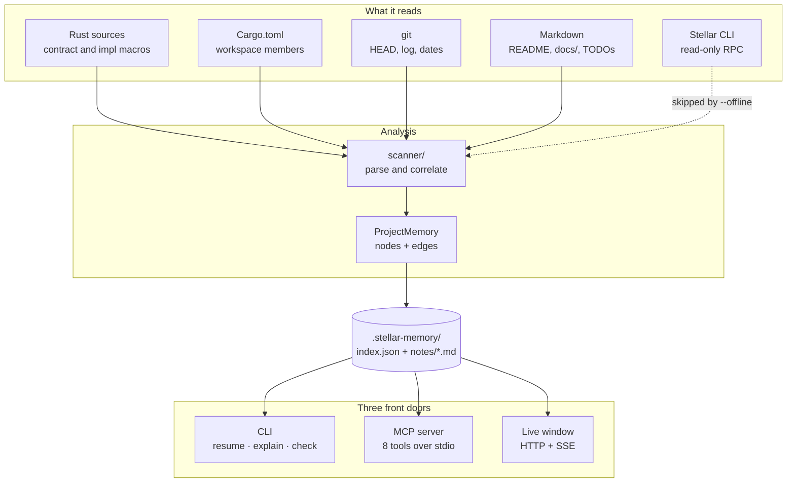
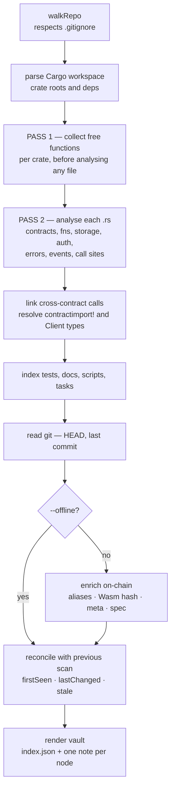
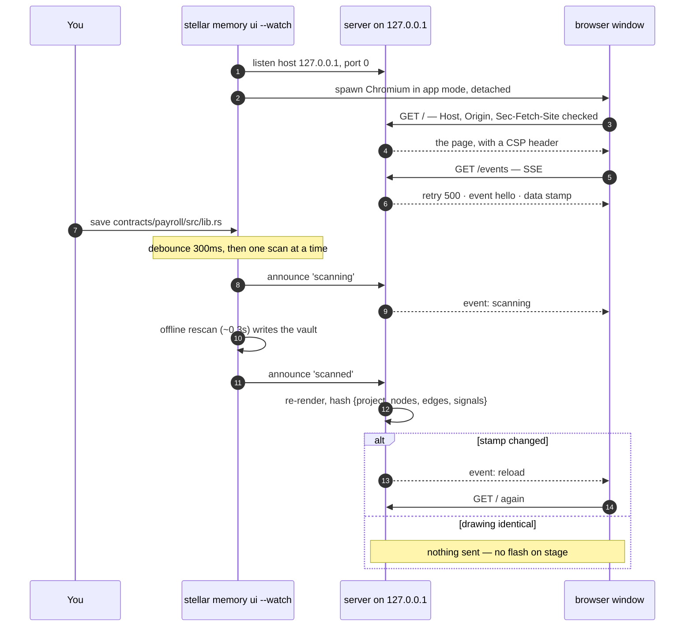
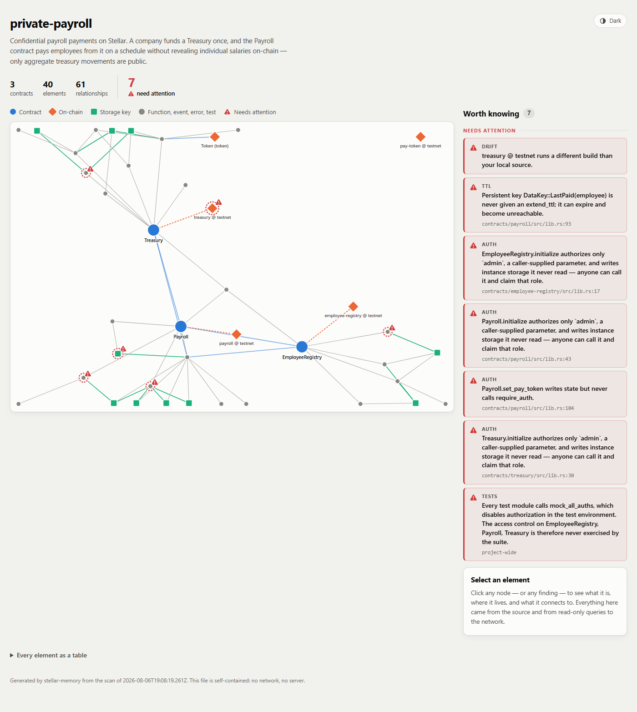
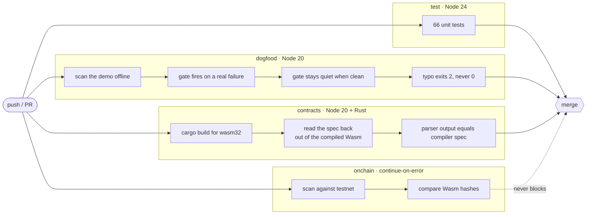

# stellar-memory

[](https://github.com/duraznito16/stellar-memory/actions/workflows/ci.yml)
[](https://www.npmjs.com/package/soroban-memory)

**A persistent memory layer for Stellar and Soroban projects.**

Current AI assistants help you *write* code. The harder problem is *keeping* the
context — what this project does, how its contracts fit together, why a decision
was made, and whether what is deployed still matches what is in your tree.

`stellar-memory` scans a Soroban repository, links its source to what is
actually live on the network, and stores the result as a knowledge graph that
both you and your AI agents can query.

```
$ stellar memory resume

private-payroll
Confidential payroll payments on Stellar. A company funds a Treasury once, and the
Payroll contract pays employees from it without revealing individual salaries.

Last commit  14 days ago on main

Contracts
  EmployeeRegistry       4 fn  deployed: testnet
  Payroll                4 fn  deployed: testnet
  Treasury               4 fn  deployed: testnet

  Entry points: Payroll

On-chain
  payroll                testnet   out of sync with local source
  pay-token              testnet   external dependency

Worth knowing
  ! Persistent key DataKey::LastPaid(employee) is never given an extend_ttl;
    it can expire and become unreachable.
  ! Payroll.set_pay_token changes state but never calls require_auth.

Open tasks
  □ Complete withdrawal tests for Payroll                README.md:24
  □ pay() needs an end-to-end test with a real Treasury  payroll/src/test.rs:23
```

---

## Why this is Stellar-specific

A generic "summarise my repo" tool cannot tell you any of this. `stellar-memory`
reads the things only a Soroban project has:

- **The real contract interface**, from the compiled Wasm or from the network —
  not from parsing `.rs` text. Functions, types, errors, and event definitions as
  the contract actually exposes them.
- **Code ↔ on-chain drift.** It compares the SHA-256 of your local build against
  the Wasm installed at your contract's address and tells you when what is
  running on testnet is older than what you have.
- **Real cross-contract edges**, resolved through `contractimport!` and the Wasm
  artifact each module imports — so `Payroll → Treasury` is evidence, not a guess.
- **Storage durability and TTL.** Every `instance` / `persistent` / `temporary`
  key, and whether it is ever given an `extend_ttl`. A persistent entry with no
  TTL extension can expire and become unreachable — a Soroban-only footgun that
  is easy to forget between sessions.
- **Whose authority, not whether there is any.** `require_auth` on an address
  loaded from storage is a real access-control gate. `require_auth` on a
  caller-supplied parameter restricts nobody — the caller just proves they
  control an address they chose. A boolean cannot tell those apart, so the
  memory records the subject and where it came from.
- **Upgradeability.** Whether a contract can replace its own code, and through
  which function. It is the fact that gates every other decision about it.
- **Error codes as published ABI.** Every `#[contracterror]` variant with its
  discriminant, and which functions can raise it. Clients match on the integer —
  a failed call reaches them as `Error(Contract, #2)` — so renumbering a variant
  breaks integrations without breaking the build. Scans compare the source
  discriminants against the deployed spec.
- **Where value moves.** Token and Stellar Asset Contract clients are not
  workspace crates, so nothing links them to a source file. The memory records
  each one, the methods called on it, and whether its address is configured in
  storage or supplied by the caller.

## Two front doors, one index

The same knowledge graph serves a human and an agent.

**You**, in the terminal:

```bash
stellar memory resume                       # get your context back
stellar memory explain "how does pay work?" # ask
stellar memory ui                           # look at it, and keep looking
stellar memory graph --format mermaid       # paste the map into a PR
```

**Your agent**, over MCP:

```jsonc
// .mcp.json / claude_desktop_config.json
{
  "mcpServers": {
    "stellar-memory": {
      "command": "stellar-memory",
      "args": ["--cwd", "/path/to/your/project", "mcp"]
    }
  }
}
```

The server exposes `project_overview`, `search_memory`, `describe_node`,
`list_contracts`, `storage_layout`, `value_surface`, `project_signals` and
`recent_changes` — so an agent can orient itself in a Soroban codebase before
touching it, instead of grepping blindly.

### What that buys, concretely

An agent asked *"could this contract ever pay an employee twice?"* answers it in
four calls, without opening a single file. Every response below is real output
from the demo workspace in this repo:

**1.** `project_signals` — start from what the project already knows is wrong:

```json
{ "severity": "warn", "category": "ttl",
  "message": "Persistent key DataKey::LastPaid(employee) is never given an extend_ttl; it can expire and become unreachable.",
  "nodeId": "storage:Payroll.persistent.DataKey::LastPaid(employee)" }
```

**2.** `storage_layout` — who depends on that key:

```json
{ "key": "DataKey::LastPaid(employee)", "durability": "persistent",
  "ttl_extended": false, "read_by": ["last_paid"], "written_by": ["pay"] }
```

**3.** `describe_node {"id":"function:Payroll.pay"}` — what `pay` actually does:

```
Payroll.pay -> EmployeeRegistry   calls `salary_of` — address from `DataKey::Registry`
Payroll.pay -> Treasury           calls `withdraw`  — address from `DataKey::Treasury`
```

**4.** The conclusion, which no single fact contains: `pay` writes `LastPaid` and
guards on it, the key is **persistent with no `extend_ttl`**, and `pay` moves
real funds through `Treasury.withdraw`. When that entry expires, the guard reads
as *never paid* — and the same salary goes out twice. It is not a logic bug; the
code is correct until Soroban's TTL rules delete the state it relies on.

That chain is the argument for the whole tool. Each step is a lookup, not an
inference, and an agent grepping `.rs` files would find the `if` statement and
conclude the contract was safe.

## It ships the agents, not just the data

```bash
stellar-memory init --with-agents
```

writes a team of Claude Code subagents into **your** project, already wired to
your memory:

| Agent | What makes it different |
|---|---|
| `stellar-resume` | Gets your context back after time away. Produces a briefing, not an analysis |
| `stellar-explorer` | Read-only, breadth-first. Answers with links into the vault so you can verify |
| `stellar-debugger` | Starts at a symptom and works *backward* through the graph. Will not propose a fix without a `file:line` |
| `stellar-builder` | The only one that edits contracts. Must read the project's auth and storage conventions first |
| `stellar-archivist` | Writes the *human* half of the notes — the reasoning a scan can never recover |

They differ in access pattern, tools and stopping rule, not in tone. The
archivist is the one that makes the vault compound: without someone recording
*why*, the human half of every note stays empty and the memory only ever
regenerates rather than accumulates.

### Seeing what an agent sees

The MCP server speaks JSON-RPC over stdio, which is right for an agent and
awkward for a person. `scripts/mcp-call.mjs` is the bridge — useful for checking
what a tool actually returns before trusting its description:

```bash
node scripts/mcp-call.mjs --list
node scripts/mcp-call.mjs project_overview
node scripts/mcp-call.mjs describe_node '{"id":"contract:Payroll"}'
```

## See it



```bash
stellar memory ui
```

Opens the graph in a window and keeps it current: the contracts, what they call,
the storage they touch, and what is live on chain. Click any node for its source
location, its relationships, and any findings against it. Nodes with something
worth knowing carry a ring, and the findings are listed beside the picture so a
reader gets them without clicking; colour never carries the meaning on its own.

The window reloads itself whenever the memory changes, so a scan in another
terminal is on screen a moment later. Add `--watch` and editing a contract is
enough — a Rust save triggers an offline rescan, and the picture follows the
code. It says so when a rescan fails, because a graph that is quietly older than
the source is worse than no graph.

It serves from `127.0.0.1` and refuses any request that did not come from
itself, which matters because what it publishes is a map of your source tree and
conference Wi-Fi is not your machine. Nothing is written to the project: the page
is a string in memory, so `--watch` cannot end up watching its own output.

### What `--watch` looks like

The demo ships `set_pay_token` with a real defect and a `FIXME` admitting it:
the function rewrites which token salaries are paid in, and never checks who is
asking. `stellar memory ui --watch` is running; nothing else is.

**Before** — seven findings, one of them that function:



Add the check the FIXME asks for — read the admin out of instance storage and
require its authorization — and **save**. No command is run:

```rust
let admin: Address = env.storage().instance().get(&DataKey::Admin).unwrap();
admin.require_auth();
```

**After** — six, and the window says so itself: the counter carries a `was 7`
beside it, and the relationship count goes up by one, because the fix added a
read of `DataKey::Admin` that was not there before.



The finding did not merely disappear. In the page's own data the function went
from

```json
"findings": [{ "severity": "warn", "category": "auth",
  "message": "Payroll.set_pay_token writes state but never calls require_auth." }]
```

to

```json
"findings": [],
"links": [{ "kind": "reads", "other": "DataKey::Admin (instance)" }]
```

It recognised *why* the code is now safe: authority read from storage is a gate
that binds the caller, where authority taken as a parameter is not. That
distinction is the difference between an access-control check and a decoration,
and it is the reason this cannot be a boolean.

```bash
stellar memory graph --format html
```

The same picture as one self-contained file — no server, no build, no network.
Use it for the copy that outlives the session: it is deterministic, so it diffs
in git next to the vault it describes, and it can be committed or attached to a
pull request. The written file carries no reference to a server, so it still
works months later on a machine where nothing is listening. `stellar memory ui
--once` writes that same file and opens it.

## The vault is a folder of Markdown

`scan` writes `.stellar-memory/`: an `index.json` for tooling, and one Markdown
note per contract, function, storage key, deployment and task, linked with
`[[wikilinks]]`.

That folder **is a valid Obsidian vault** — open it and the graph is there. It is
also diffable in git, so you can watch a team's understanding of a system evolve
alongside the code.

Each note has a machine-owned block:

```markdown
<!-- stellar-memory:auto -->
...regenerated on every scan...
<!-- /stellar-memory:auto -->

## Notes
Anything you write here is yours. It is never overwritten.
```

That split is the point. Structural facts stay current automatically; the
reasoning that source code cannot hold — why this design, what was tried and
rejected — is written once and kept forever. When a contract disappears, its
note is **marked stale, never deleted**.

---

# How it works

## One index, three readers

There is exactly one place where knowledge lives, and everything else reads it.
No surface has a private cache, so a human, an agent and a window can never
disagree about the same project.



The dotted edge is the whole reason `--offline` exists: everything above it is
deterministic and works on a plane, and only the network half can be slow,
absent, or reset by someone else.

## The scan pipeline

`scan` is a single pass with a deliberate ordering. Three of these stages exist
because doing them in the obvious order produced wrong answers.



**Why two passes over the Rust.** Soroban crates are module-scoped: `mod balance;`
puts helper functions in a sibling file. A contract whose storage lives in
`admin.rs` / `balance.rs` / `allowance.rs` — the canonical token layout — appears
to touch no storage at all if you analyse files one at a time. Pass 1 gathers
every crate's free functions first; pass 2 can then follow a call into a sibling
module and attribute the storage it touches.

**Why call linking is its own stage.** A `calls` edge runs from a *function* to a
*contract*, and the target contract may be parsed after the caller. Emitting the
edge during the file loop drops every call whose target appears later in the walk.

**Why reconciliation is last.** `firstSeen` and `lastChanged` are computed by
fingerprinting each node against the previous scan. It has to see the finished
graph, and it is what makes `recent_changes` a diff rather than a listing.

## What is in the graph

16 node kinds and 12 edge kinds, all derived from structure — never from a name.

| Node kind | What proves it exists |
|---|---|
| `contract` | a Rust type annotated `#[contract]` |
| `function` | a `pub fn` inside a `#[contractimpl]` block |
| `type` / `error` / `event` | `#[contracttype]`, `#[contracterror]`, `#[contractevent]` or a published topic |
| `storage` | a distinct key written to instance, persistent or temporary storage |
| `deployment` | a live contract ID, resolved through a committed alias |
| `asset` | a token or SAC client this project moves value through |
| `crate` · `module` · `test` · `script` · `doc` | Cargo members, sources, test modules, build scripts, Markdown |
| `task` · `decision` | pending work found in the tree; human-written rationale |

| Edge kind | Meaning |
|---|---|
| `defines` | structural containment — crate defines contract defines function |
| `calls` | a cross-contract call, evidenced by `contractimport!` or a generated `Client` |
| `reads` / `writes` | a function touches a storage key |
| `emits` / `raises` | a function publishes an event or can return an error variant |
| `deployed_as` | source contract ↔ live instance on a network |
| `tests` / `deploys` / `depends_on` | coverage, build scripts, Cargo dependencies |

The rule the whole design serves: **a false positive is worse than a missing
feature.** Every edge is evidence. `Payroll → Treasury` exists because the
generated client type and the address it is constructed from were both found, not
because two contracts share a word.

## How the live window stays current

`ui` holds the page in memory and never writes to your project. That is not
frugality — it is what makes `--watch` safe, because a renderer that wrote a file
would be watching its own output.



Four details that are load-bearing:

- **The stamp hashes the drawing, not the memory.** Every scan appends a record to
  `memory.scans`, so hashing the whole memory reloads the window on every save
  even when the picture is unchanged. On a projector that reads as a flicker with
  no cause.
- **A failed rescan says so.** `scan-failed` is its own event. The window keeps
  the last graph that worked and stops claiming to be live — a graph quietly older
  than the source is worse than no graph.
- **Shutdown ends the streams first.** An open SSE response is an *active* request,
  so `server.close()` alone waits on it forever and Ctrl+C appears to hang. The
  order is: send `bye`, end each stream, `close()`, then sweep stragglers 250ms
  later. Verified end to end: exit code 0, ~15ms, one interrupt.
- **The committed artifact never learns about the server.** `live` is a render
  option, off by default, so `graph --format html` is byte-identical with or
  without the window feature and carries no localhost reference. A test asserts it.

### What the window will not do

It binds `127.0.0.1` and nothing else — there is one `listen` call and no host
field on its options type, so no caller can widen it. It answers exactly two
routes, both string literals, and no request-derived value reaches a filesystem
call, so there is no path to traverse. Foreign `Host`, foreign `Origin`, and
cross-site `Sec-Fetch-Site` are refused, which is what stops a web page from
reading your source map over DNS rebinding.

What it publishes is a map of your private tree, and conference Wi-Fi is not your
machine.

## The module map

```
src/
  scanner/     rust.ts     1302   Soroban source analysis — the hard part
               scan.ts     1296   graph construction and correlation
               cargo.ts     126   workspace parsing
               walk.ts      106   gitignore-aware file walk
  core/        query.ts     731   signals, search, resume, neighbourhoods
               types.ts     247   the graph model
               git.ts       121   HEAD, last commit, dates
  stellar/     cli.ts       266   read-only Stellar CLI bridge
               spec.ts      140   SCSpecEntry → functions, errors, events
  store/       html.ts     1300   the self-contained page and the live page
               render.ts    384   Markdown notes
               vault.ts     269   read/write .stellar-memory/
  ui/          serve.ts     353   loopback HTTP + SSE hub + shutdown
               watch.ts     249   debounced, non-overlapping watchers
               open.ts      242   cross-platform window launcher
  commands/    mcp.ts       802   the 8 agent-facing tools
               ui.ts        206   wiring for the live window
               graph.ts     229   tree, mermaid, dot, json, html
```

`rust.ts` and `scan.ts` are a quarter of the codebase, and the largest thing in
it after them is the page they end up drawn on. That weighting is the point:
the claim this tool makes is that its facts are true, and everything else reads
what those two produce.

## The committable artifact

The window is for working; the file is for the record.



```bash
stellar memory graph --format html
```

Deterministic, so it diffs in git next to the vault it describes. `stellar memory
ui --once` writes that same file and opens it — the output is md5-identical, which
a test enforces.

## Install

```bash
npm install -g soroban-memory
```

The binary is named `stellar-memory`, so the Stellar CLI picks it up as a plugin
and `stellar memory <command>` works natively. `npx soroban-memory` works too.

Requires Node 20+. The Stellar CLI is optional — without it you still get the
full source-level memory, just not the on-chain half.

## Commands

| Command | What it does |
|---|---|
| `scan` | Analyse the repo and update the memory. Creates the vault if there isn't one. `--offline` skips all network and CLI calls |
| `resume` | Recover context: what this is, what moved, what is pending |
| `explain [question]` | Ask about the project. `--ai` for a written answer |
| `ui` | Open the graph in a window and keep it current. `--watch` rescans offline on a Rust edit; `--once` writes the standalone file instead. Binds `127.0.0.1` only |
| `graph` | Show how it fits together — `tree`, `mermaid`, `dot`, `json`, or `html` |
| `check` | Exit non-zero when the project has blocking issues. For CI |
| `mcp` | Serve the memory to agents over MCP (stdio) |
| `init` | Create the vault explicitly. `--with-agents` also scaffolds the agent team |

## Keeping it current

A memory nobody refreshes goes stale, and a stale memory is worse than none —
it still reads as current. Three levels, pick one:

| | |
|---|---|
| **Manual** | `stellar memory scan` |
| **Reminded** | `resume` says so when the memory was built at a different commit than `HEAD` |
| **Automatic** | a `post-commit` hook |

The offline scan takes about a third of a second, which is small enough to sit in
a commit hook unnoticed:

```bash
cp node_modules/soroban-memory/templates/hooks/post-commit .git/hooks/
chmod +x .git/hooks/post-commit
```

It is offline by design — a commit hook must never wait on the network — and it
can never fail a commit that already happened. The on-chain half belongs in CI.

## In CI

```bash
stellar-memory scan --offline
stellar-memory check --fail-on auth,ttl
```

`check` exits `1` when a checked category has findings, `0` when clean, and `2`
when it is misconfigured — a typo in `--fail-on` must not make a pipeline green
for the wrong reason. Categories: `drift`, `ttl`, `auth`, `abi`, `value`,
`tests`, or `all`.

The one worth wiring up first is **`drift`**. Testnet gets reset, people
redeploy by hand, and nobody knows whether what is running is what is on `main`.
That check answers it by comparing Wasm hashes, and there is nothing else that
will tell you.

A ready workflow — offline checks on every PR, drift checked separately so forks
without secrets skip rather than fail — is in
[`templates/workflows/stellar-memory.yml`](templates/workflows/stellar-memory.yml).

## The AI layer is optional

`scan`, `resume` and `graph` are fully deterministic — static analysis plus
read-only CLI calls. They work offline, with no API key, and their output is
reproducible.

Only `explain --ai` calls a model, and it is given the project digest and told to
answer strictly from it. Everything the AI produces is labelled as inferred; a
memory that confidently invents a contract is worse than no memory at all.

Set `ANTHROPIC_API_KEY` (or run `ant auth login`). Override the model with
`STELLAR_MEMORY_MODEL`.

## Safety

Every network call this tool makes is **read-only**: contract interfaces, Wasm
hashes, metadata, and alias lookups. It never signs, deploys, or spends. That
boundary is deliberate.

## Try it

The repo ships a demo Soroban workspace with real, deliberate defects:

```bash
git clone <this repo> && cd stellar-memory
npm install && npm run build
node dist/index.js --cwd demo/private-payroll init
node dist/index.js --cwd demo/private-payroll scan
node dist/index.js --cwd demo/private-payroll resume
```

## What CI proves

The badge above is not just "the tests pass". Every push runs the tool against
the demo Soroban workspace and asserts what it claims:



The job worth understanding is `contracts`: the demo is compiled to Wasm, the
Stellar CLI reads the spec back out of the binary, and the functions the analyser
reported are compared against it. That is **static analysis validated against
`rustc`**, not against opinion — and it is the reason the graph can be trusted.


- **The parser agrees with the compiler.** The demo is built to Wasm, and the
  public functions the analyser reports are compared against the spec embedded
  in the compiled binary. Static analysis validated against `rustc`, not against
  opinion.
- **The gate works in all three states.** It fires on a category the demo
  genuinely fails, stays quiet on one it is clean on, and exits `2` — not `0` —
  on an unknown category, so a typo cannot turn a pipeline green.
- **The published artifact runs on the minimum supported Node.** The test suite
  runs on Node 24; the built CLI is exercised end to end on Node 20.
- **On-chain drift is checked against real testnet deployments.** Contract
  aliases are committed, so this needs no credentials — and every call is
  read-only.

That last job is `continue-on-error`. Testnet is reset periodically and these
contracts will vanish with it; that is a fact about the network, not a defect
here, and blocking merges on it would only train people to ignore the badge.

## Development

```bash
npm run build       # compile
npm test            # builds first, then parser, MCP handshake, and CI-gate tests
npm run typecheck
```

`npm test` compiles before it runs anything, because the MCP and live-window
tests spawn `dist/index.js` as a real subprocess — they exercise the CLI that
ships, not an import of the same source. On a fresh clone there is no `dist/`
yet, and a suite whose first failure is `ENOENT` teaches a newcomer nothing.

Running the package needs **Node 20+**. Running the *tests* needs **Node 22.6+**,
because they are TypeScript executed through Node's native type stripping. CI
runs the suite on Node 24 and exercises the built CLI on Node 20, so the minimum
supported version is proven rather than asserted.

## License

Apache-2.0
